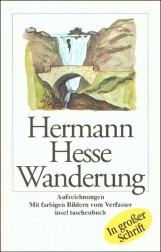
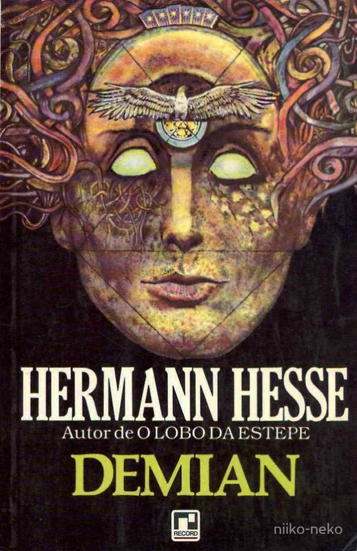
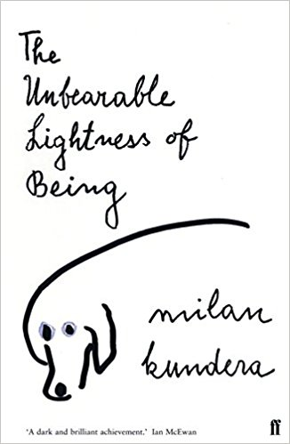
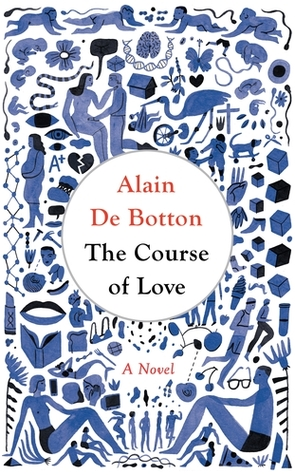
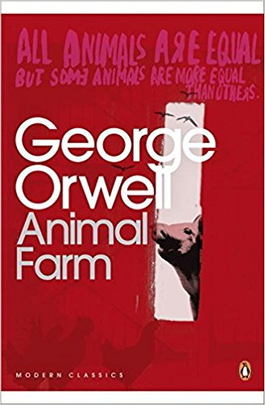

# My absolute **favourites** #
1. Brothers Karamazov by Fyodor Dostoyevski

2. Wandering by Hermann Hesse

3. Demian by Hermann Hesse

4. The Unbearable Lightness of Being by Milen Kundera 

5. The Course of Love by Alain de Botton

6. Kafka on the Shore by Haruki Murakami 

7. Animal Farm by George Orwell 

